<<<<<<< HEAD
CAMBIOS\_MICROCLIMA\_HABITATS
================

# CÓDIGO

## Cargar librerías

=======
Untitled
================

>>>>>>> 30dde5ca495c67d153f3b3fbfbce9662bbfdb95b
``` r
library(raster)
library(tidyverse)
library(rasterVis)
library(ggpubr)
library(microclima)
library(magrittr)
library(sf)
library(rgdal)
library(rgl)
library(magick)
library(greenbrown)
library(rayshader)
```

## Generar modelo digital de elevaciones, pendientes y orientaciones

``` r
C_1x1KM <- readOGR("T:/MICROCLIMA/CHANGES/Cuadriculas_seleccionadas.shp") %>%
  spTransform(CRS("+proj=merc +lon_0=0 +k=1 +x_0=0 +y_0=0 +datum=WGS84 +units=m +no_defs"))
```

    ## OGR data source with driver: ESRI Shapefile 
    ## Source: "T:\MICROCLIMA\CHANGES\Cuadriculas_seleccionadas.shp", layer: "Cuadriculas_seleccionadas"
    ## with 4 features
    ## It has 5 fields

``` r
centr <- st_as_sf(C_1x1KM) %>%
  st_centroid()%>%
  as_Spatial()%>%
  spTransform(CRS("+proj=merc +lon_0=0 +k=1 +x_0=0 +y_0=0 +datum=WGS84 +units=m +no_defs"))

lat_long <- coordinates(spTransform(centr, CRS("+proj=longlat + datum=WGS84")))
lat_comp <- lat_long[,2]
long_comp <- lat_long[,1]

Nombres<- c("30TUK15B","30TVL11C","30TXK17D","30TXK64D")


for (j in 1:4){
  lat <- lat_comp[j]
  long <- long_comp[j]
  assign(paste("MDT_" ,Nombres[j], sep = ""),microclima::get_dem(lat = lat, long = long, resolution = 30))
}

  PENDIENTE_30TUK15B <- terrain(MDT_30TUK15B, opt = "slope", unit = "degrees", neighbors = 8)
  PENDIENTE_30TVL11C <- terrain(MDT_30TVL11C, opt = "slope", unit = "degrees", neighbors = 8)
  PENDIENTE_30TXK17D <- terrain(MDT_30TXK17D, opt = "slope", unit = "degrees", neighbors = 8)
  PENDIENTE_30TXK64D <- terrain(MDT_30TXK64D, opt = "slope", unit = "degrees", neighbors = 8)
  
  ORIENTACION_30TUK15B <- terrain(MDT_30TUK15B, opt = "aspect", unit = "degrees", neighbors = 8)
  ORIENTACION_30TVL11C <- terrain(MDT_30TVL11C, opt = "aspect", unit = "degrees", neighbors = 8)
  ORIENTACION_30TXK17D <- terrain(MDT_30TXK17D, opt = "aspect", unit = "degrees", neighbors = 8)
  ORIENTACION_30TXK64D <- terrain(MDT_30TXK64D, opt = "aspect", unit = "degrees", neighbors = 8)
```

<<<<<<< HEAD
# GRÁFICOS PARA CONOCER LAS CUADRÍCULAS

## 30TUK15B GREDOS

### 3D

``` r
knitr::knit_hooks$set(webgl = hook_webgl)


elmat = raster_to_matrix(MDT_30TUK15B)

elmat %>%
  sphere_shade(texture = "desert") %>%
  add_shadow(ray_shade(elmat, zscale = 3), 0.5) %>%
  add_shadow(ambient_shade(elmat), 0) %>%
  plot_3d(elmat, zscale = 10, fov = 0, theta = 135, zoom = 0.75, phi = 45, windowsize = c(1000, 800))
render_camera(fov = 0, theta = 60, zoom = 0.75, phi = 45)
render_compass(position = "E")
render_snapshot(clear = TRUE)
```

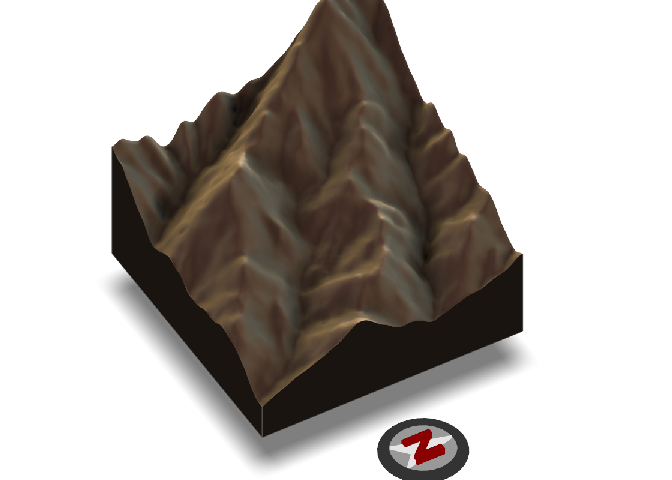<!-- -->

=======
>>>>>>> 30dde5ca495c67d153f3b3fbfbce9662bbfdb95b
### PENDIENTE

``` r
plot(PENDIENTE_30TUK15B, col=brgr.colors(20))
```

<<<<<<< HEAD
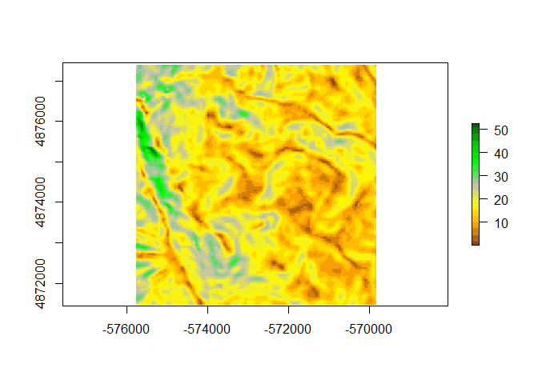<!-- -->
=======
<!-- -->
>>>>>>> 30dde5ca495c67d153f3b3fbfbce9662bbfdb95b

``` r
histogram(PENDIENTE_30TUK15B,
          xlab = "Pendiente (%)", ylab= "Frecuencia", col="green")
```

<<<<<<< HEAD
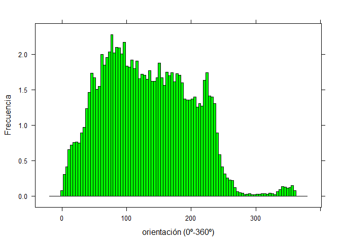<!-- -->
=======
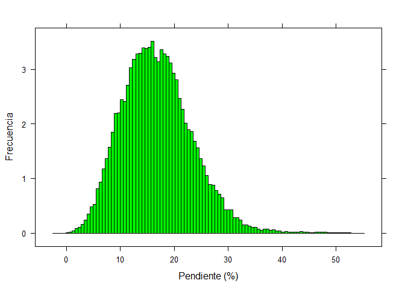<!-- -->
>>>>>>> 30dde5ca495c67d153f3b3fbfbce9662bbfdb95b

### ORIENTACIÓN

``` r
plot(ORIENTACION_30TUK15B, col=brgr.colors(20))
```

<<<<<<< HEAD
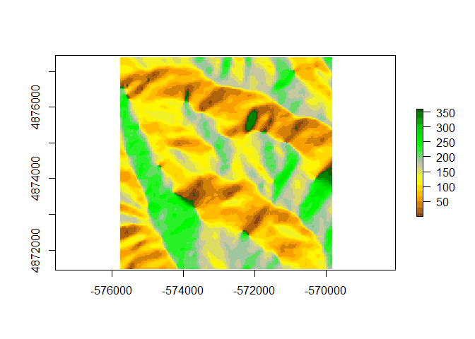<!-- -->
=======
<!-- -->
>>>>>>> 30dde5ca495c67d153f3b3fbfbce9662bbfdb95b

``` r
histogram(ORIENTACION_30TUK15B,
          xlab = "orientación (0º-360º)", ylab= "Frecuencia", col="green")
```

<<<<<<< HEAD
<!-- -->

## 30TVL11C GUADARRAMA

### 3D

``` r
knitr::knit_hooks$set(webgl = hook_webgl)


elmat = raster_to_matrix(MDT_30TVL11C)

elmat %>%
  sphere_shade(texture = "desert") %>%
  add_shadow(ray_shade(elmat, zscale = 3), 0.5) %>%
  add_shadow(ambient_shade(elmat), 0) %>%
  plot_3d(elmat, zscale = 10, fov = 0, theta = 135, zoom = 0.75, phi = 45, windowsize = c(1000, 800))
render_camera(fov = 0, theta = 60, zoom = 0.75, phi = 45)
render_compass(position = "E")
render_snapshot(clear = TRUE)
```

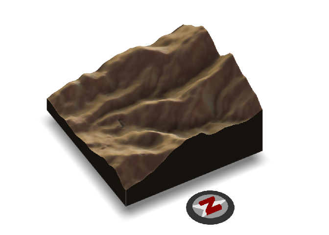<!-- -->

### PENDIENTE

``` r
plot(PENDIENTE_30TVL11C, col=brgr.colors(20))
```

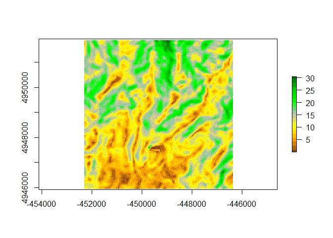<!-- -->

``` r
histogram(PENDIENTE_30TVL11C,
          xlab = "Pendiente (%)", ylab= "Frecuencia", col="green")
```

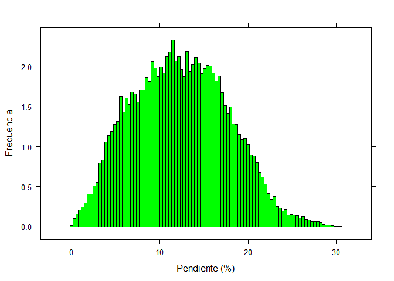<!-- -->

### ORIENTACIÓN

``` r
plot(ORIENTACION_30TVL11C, col=brgr.colors(20))
```

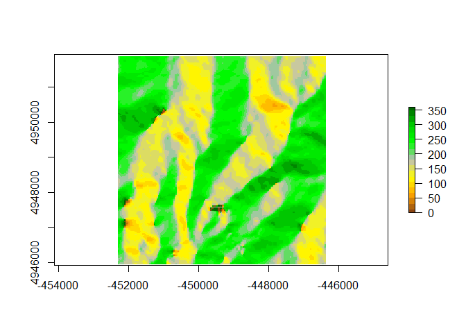<!-- -->

``` r
histogram(ORIENTACION_30TVL11C,
          xlab = "Orientación (0º-360º)", ylab= "Frecuencia", col="green")
```

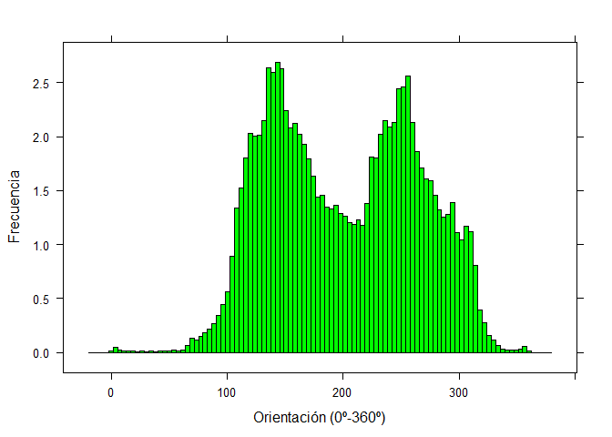<!-- -->

## 30TXK17D MERIDIONAL

### 3D

``` r
knitr::knit_hooks$set(webgl = hook_webgl)


elmat = raster_to_matrix(MDT_30TXK17D)

elmat %>%
  sphere_shade(texture = "desert") %>%
  add_shadow(ray_shade(elmat, zscale = 3), 0.5) %>%
  add_shadow(ambient_shade(elmat), 0) %>%
  plot_3d(elmat, zscale = 10, fov = 0, theta = 135, zoom = 0.75, phi = 45, windowsize = c(1000, 800))
render_camera(fov = 0, theta = 60, zoom = 0.75, phi = 45)
render_compass(position = "E")
render_snapshot(clear = TRUE)
```

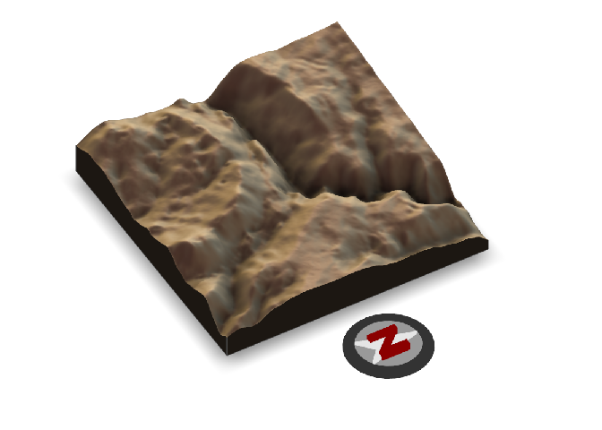<!-- -->

### PENDIENTE

``` r
plot(PENDIENTE_30TXK17D, col=brgr.colors(20))
```

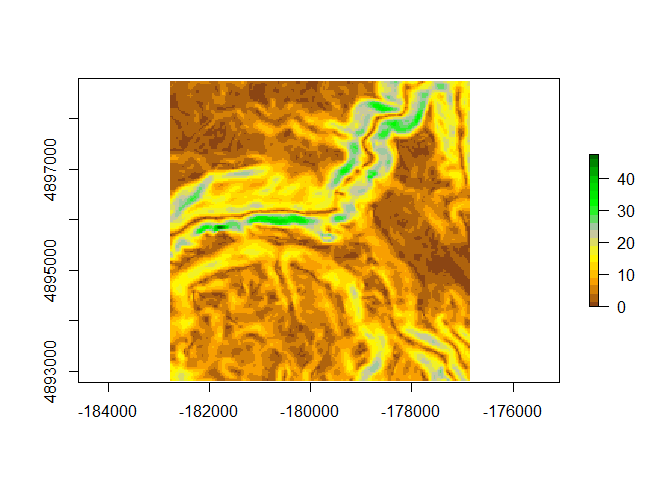<!-- -->

``` r
histogram(PENDIENTE_30TXK17D,
          xlab = "Pendiente (%)", ylab= "Frecuencia", col="green")
```

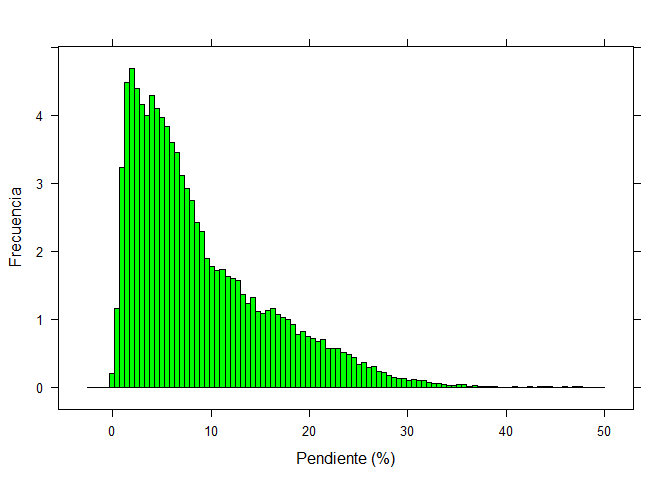<!-- -->

### ORIENTACIÓN

``` r
plot(ORIENTACION_30TXK17D, col=brgr.colors(20))
```

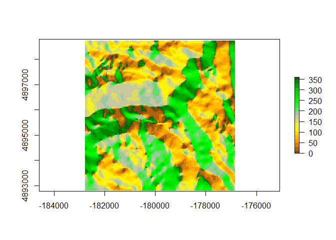<!-- -->

``` r
histogram(ORIENTACION_30TXK17D,
          xlab = "Orientación (0º-360º)", ylab= "Frecuencia", col="green")
```

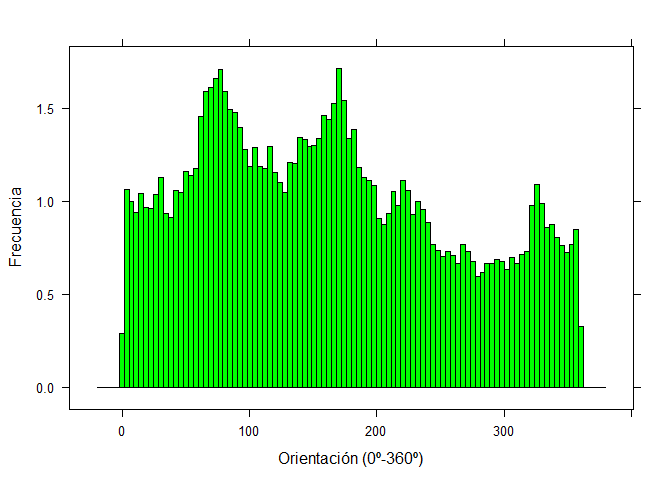<!-- -->

## 30TXK64D JAVALAMBRE

### 3D

``` r
knitr::knit_hooks$set(webgl = hook_webgl)


elmat = raster_to_matrix(MDT_30TXK64D)

elmat %>%
  sphere_shade(texture = "desert") %>%
  add_shadow(ray_shade(elmat, zscale = 3), 0.5) %>%
  add_shadow(ambient_shade(elmat), 0) %>%
  plot_3d(elmat, zscale = 10, fov = 0, theta = 135, zoom = 0.75, phi = 45, windowsize = c(1000, 800))
render_camera(fov = 0, theta = 60, zoom = 0.75, phi = 45)
render_compass(position = "E")
render_snapshot(clear = TRUE)
```

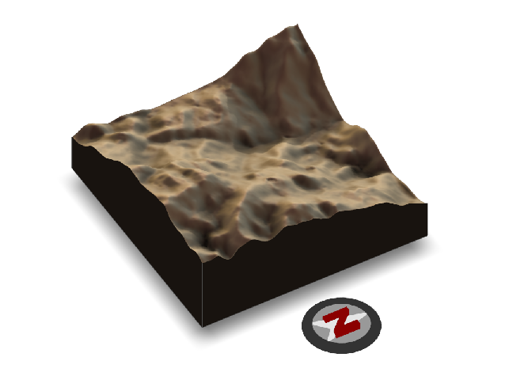<!-- -->

### PENDIENTE

``` r
plot(PENDIENTE_30TXK64D, col=brgr.colors(20))
```

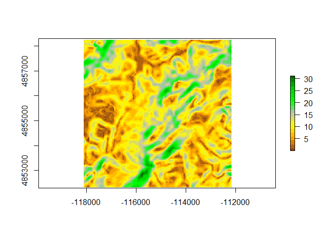<!-- -->

``` r
histogram(PENDIENTE_30TXK64D,
          xlab = "Pendiente (%)", ylab= "Frecuencia", col="green")
```

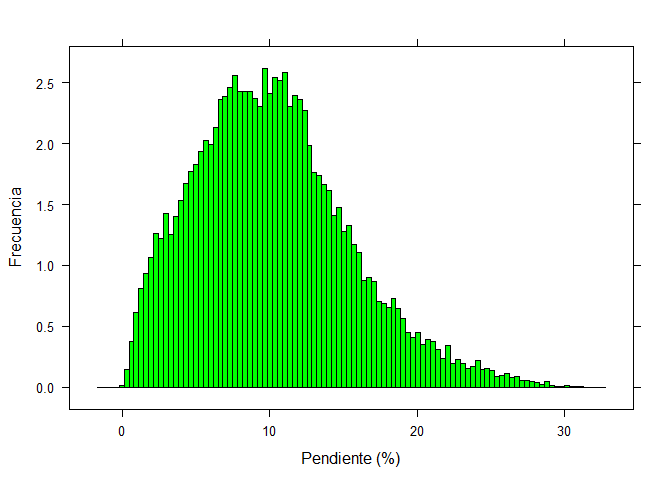<!-- -->

### ORIENTACIÓN

``` r
plot(ORIENTACION_30TXK64D, col=brgr.colors(20))
```

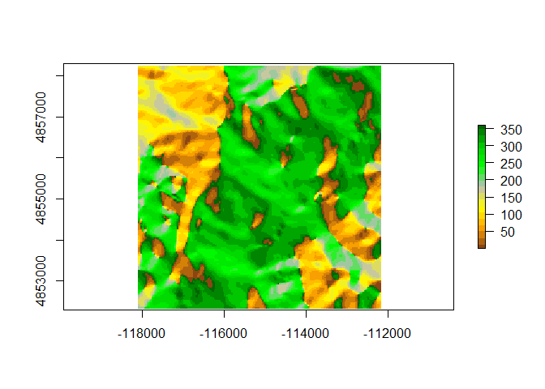<!-- -->

``` r
histogram(ORIENTACION_30TXK64D,
          xlab = "Orientación (0º-360º)", ylab= "Frecuencia", col="green")
```

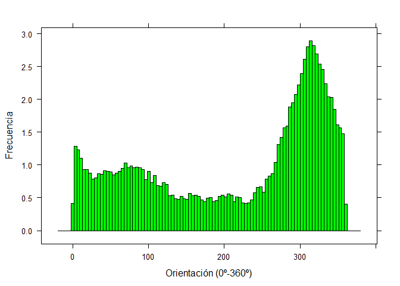<!-- -->
=======
<!-- -->
>>>>>>> 30dde5ca495c67d153f3b3fbfbce9662bbfdb95b
